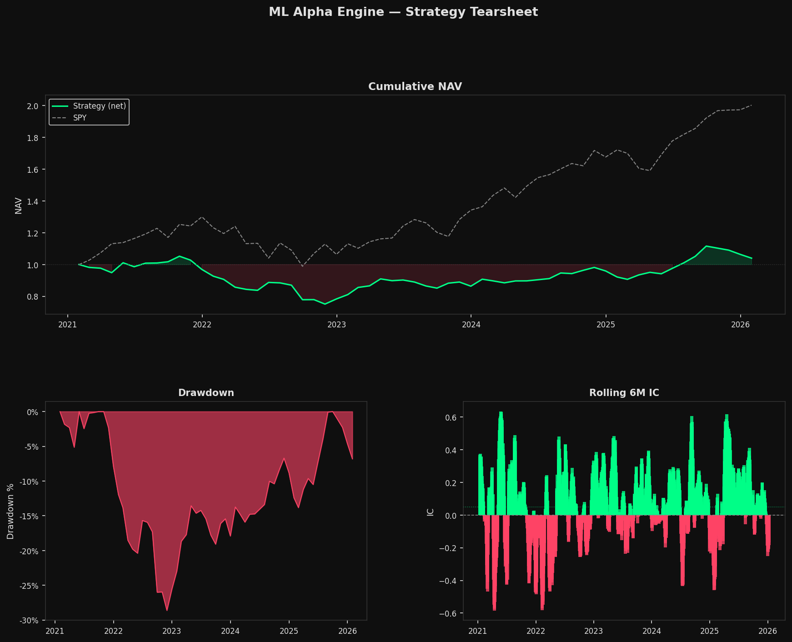

# ML Alpha Generation Engine

An end-to-end quantitative equity strategy that engineers alpha factors from price data, trains a machine learning model to predict cross-sectional stock returns, constructs a dollar-neutral long-short portfolio, and evaluates performance using industry-standard metrics.

---

## Strategy Summary

| Metric | Value |
|--------|-------|
| Mean IC | 0.062 |
| ICIR | 1.10 |
| Sharpe Ratio | 0.86 |
| Sortino Ratio | 1.41 |
| Max Drawdown | -27% |
| Hit Rate | 60.4% |
| Alpha vs SPY | +3.58% |
| Beta vs SPY | 0.43 |

---

## Architecture

```
Raw Price Data (Yahoo Finance)
        ↓
   database.py        → SQLite schema + data ingestion
        ↓
   features.py        → 12 cross-sectional alpha factors
        ↓
    model.py          → LightGBM LambdaRank + walk-forward validation
        ↓
   backtest.py        → dollar-neutral long-short portfolio simulation
        ↓
    report.py         → performance tearsheet
```

---

## Modules

### `database.py` — Data Layer
- Designs a normalized 4-table SQLite schema (equities, fundamentals, factors, predictions)
- Downloads historical OHLCV data for 30 US equities via yfinance (2018–present)
- Ingests fundamental data (PE ratio, market cap, ROE, debt-to-equity)
- Uses `INSERT OR REPLACE` for idempotent re-runs

### `features.py` — Factor Engineering
- Computes 12 alpha factors across 5 categories:
  - **Momentum:** 1M, 3M, 6M, 12M cumulative returns
  - **Reversal:** 1-month short-term reversal
  - **Volatility:** realized vol, vol ratio, Garman-Klass OHLC vol
  - **Liquidity:** Amihud illiquidity ratio (log-transformed)
  - **Price structure:** distance from 50-day and 200-day moving averages, volume z-score
- Cross-sectional z-scoring with ±3σ winsorization at each rebalance date
- Computes 1-month forward return labels for ML training

### `model.py` — Machine Learning
- Trains a LightGBM LambdaRank model to predict cross-sectional return rankings
- Walk-forward expanding window validation (10 folds, strictly no lookahead bias)
- Evaluates per-fold IC (Spearman rank correlation) and ICIR
- Tracks feature importance averaged across all folds
- Saves each fold's model to disk

### `backtest.py` — Portfolio Simulation
- Constructs a dollar-neutral long-short portfolio (top/bottom quintile)
- Equal-weight within each leg; rebalances monthly
- Applies realistic 10bps one-way transaction costs
- Tracks turnover, gross vs net returns, and cumulative NAV
- Computes rolling beta vs SPY benchmark

### `report.py` — Performance Tearsheet
- Computes Sharpe, Sortino, Calmar, max drawdown, hit rate, win/loss ratio
- Computes IC series, ICIR, and annualized turnover
- Alpha/beta decomposition vs SPY
- Generates a 3-panel dark-themed tearsheet chart:
  - Cumulative NAV vs SPY
  - Drawdown series
  - Rolling 6-month IC

---

## Tearsheet



---

## Installation

```bash
git clone https://github.com/Harsita11/ml-alpha-engine.git
cd ml-alpha-engine
pip install yfinance lightgbm scikit-learn scipy joblib matplotlib pandas numpy
```

---

## Usage

Run each module in order:

```bash
# 1. Download price data and initialize database
python database.py

# 2. Engineer alpha factors
python features.py

# 3. Train walk-forward ML models
python model.py

# 4. Simulate long-short portfolio
python backtest.py

# 5. Generate performance tearsheet
python report.py
```

---

## Key Concepts

**Information Coefficient (IC)**
Spearman rank correlation between predicted scores and actual returns. IC > 0.05 is considered a meaningful signal at quantitative hedge funds.

**Walk-Forward Validation**
The model only trains on data strictly before each test period — simulating real deployment and eliminating lookahead bias.

**LambdaRank Objective**
Stock selection is a ranking problem, not a regression problem. LambdaRank directly optimizes NDCG — the same objective used in search engine ranking.

**Dollar-Neutral Long-Short**
Equal dollar exposure on long and short legs eliminates market beta and isolates pure stock-selection alpha.

**Amihud Illiquidity**
Measures price impact per dollar of volume. Illiquid stocks earn a risk premium — this factor captures that effect.

---

## Stack

- **Python** — pandas, numpy, scipy
- **Machine Learning** — LightGBM (LambdaRank)
- **Database** — SQLite
- **Data** — yfinance (Yahoo Finance)
- **Visualization** — matplotlib

---

## Disclaimer

This project is for educational purposes only. It is not financial advice and should not be used for live trading.
